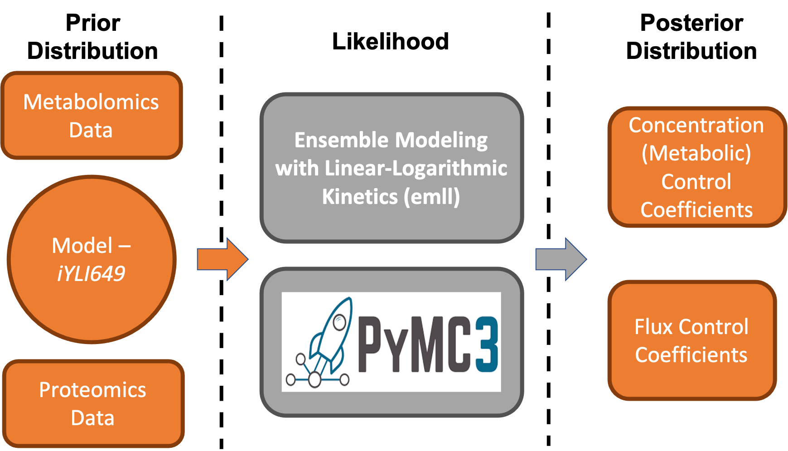

# bayesian-inference

Jupyter Notebook and data for the publication Bayesian Inference for Integrating Yarrowia lipolytica Multi-omics Datasets with Metabolic Modeling



## What is in this Repository?

This repository contains all the necessary Jupyter Notebooks and code to replicate the results obtained in our paper. This also serves as a jumping off point for expanding the work done here to your own models if necessary.

## What you will need

A conda environment is provided in this repository for the sake of easier reproducability. There are not many major packages required to run the code, but the code requires Ensemble Modeling with Linear-Logarithmic Kinetics (emll) [source](https://github.com/pstjohn/emll) which you can either install independently or download through the given environment.

### Conda Environment

To install the working environment type the following commands

```bash
conda env create -f environment.yml
```
followed by

```bash
source activate BMI
```

You can find the specific packages required in the environment.yml file. This will get you up and running with the notebooks provided.

### Jupyter Notebook

There is one primary Jupyter notebook designed to walk through the entire process of our Bayesian workflow. You will need to add the BMI environment to Jupyter in order to use it with either Jupyter Notebook/Lab

```sh
python -m ipykernel install --user --name=BMI
```

if this doesn't work, try reinstalling the ipykernel package like this:

```sh
conda install -c anaconda ipykernel
```

Once done, make sure to set the kernel to ***BMI*** before running any of the code.

### Multi-Omics Data

In this repository you will find the results of the multi-omics analysis used to complete this project. The ***Omics_Data** folder is laid out in this fashion:

```console
Omics_Data
├── 9_strain_data
│   ├── Fluxomics
│   ├── Metabolomics
│   ├── Proteomics
│   └── Transcriptomics
├── 23_strain_data
│   ├── Fluxomics
│   ├── Metabolomics
│   ├── Proteomics
│   └── Transcriptomics
```

Both sample sets ***9*** and ***24*** are used in this work, but not all files in these folders are used every run of the code pipeline. Therefore, some files are unneccesary to reproduce the results.


### Genome Scale Model

In order to carry out our Bayesian analysis, we need a genome scale model of the host organism of choice and also a model for the central metabolism derived from the larger model. These pieces of information can be found under the ***General_Information*** folder.

```console
General_Information
├── Pathways
└── YLita649
```